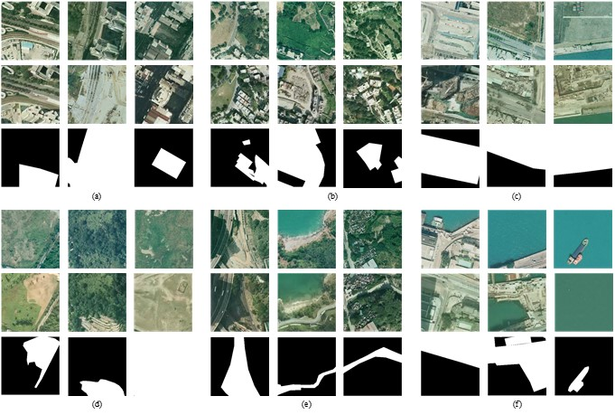

# SYSU-CD

A new change detection dataset in our recent work "A Deeply-supervised Attention Metric-based Network and an Open Aerial Image Dataset for Remote Sensing Change Detection " on [IEEE Transactions on Geoscience and Remote Sensing](https://ieeexplore.ieee.org/xpl/aboutJournal.jsp?punumber=36).


<br>

## Description

- The dataset contains 20000 pairs of 0.5m aerial images of size 256×256 taken between the years 2007 and 2014 in Hong Kong. 
- The main types of changes in the dataset include: (a) newly built urban buildings; (b) suburban dilation; (c) groundwork before construction; (d) change of vegetation; (e) road expansion; (f) sea construction.

   


<br>

## Download

- Baiduyun
- GoogleDrive
- OneDrive

** available soon 


<br>

## Citation
If you find our work useful for your research, please consider citing our paper:
```

```


